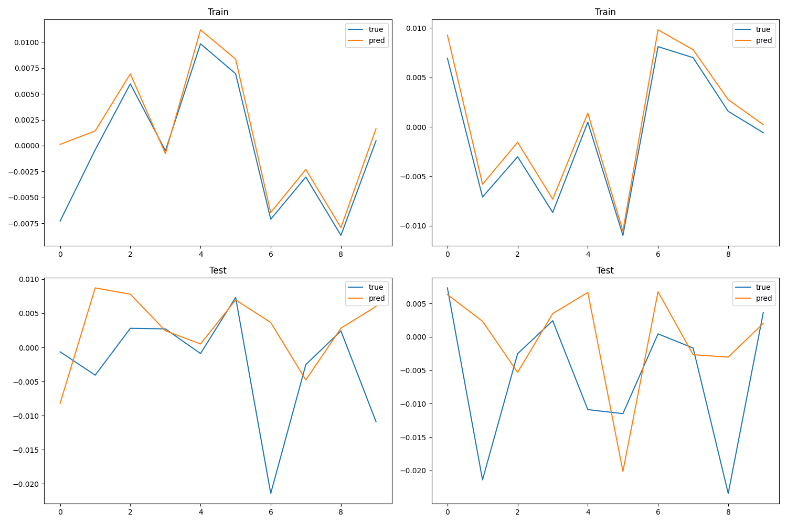
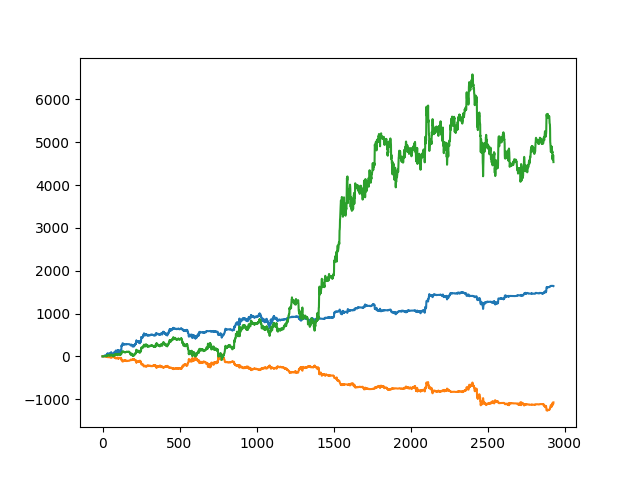

# Hello Multiverse recruiter!
I applied yesterday for the pre-sales position, and wanted to polish this projects presentation/collaborability but I am having a bad day.

If you give me two days I will make an installable library, including:
- requirements.txt for automatic installation in an env.
- Documentation of the library with Sphinx.
- A easy to reproduce demo from dataset acquisition, LSTM training, and live trading simulation.

Have a good day!
________________________________________________________________________________

## Goal
Main goal is to develop a GUI so that the user can easily:

- Call training data from the Binance API, preprocess it.
- Select a LSTM architecture and explore the hyperparameters through grid searching.
- Select the best machines judging by the training curves.
- Perform profit simulations on real, past Data or live.
- As well as simulating correlations on the real data to find out if the LSTM can capture them.

## Progress
Managed to overfit the training data. As you can see he predicts the training data perfectly, while not having generalized to validation data.
x-axis represents time, y-axis is the returns (price change in %).

A profit (y) simulation of 3 different machines on real data (last 3000 hours in x-axis). Obtained constant profit slopes instead of a random walk, which is a good sign.

Much more to come...
