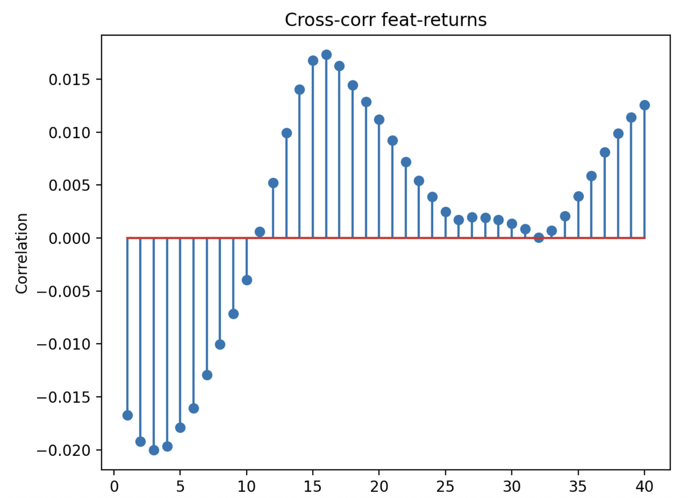
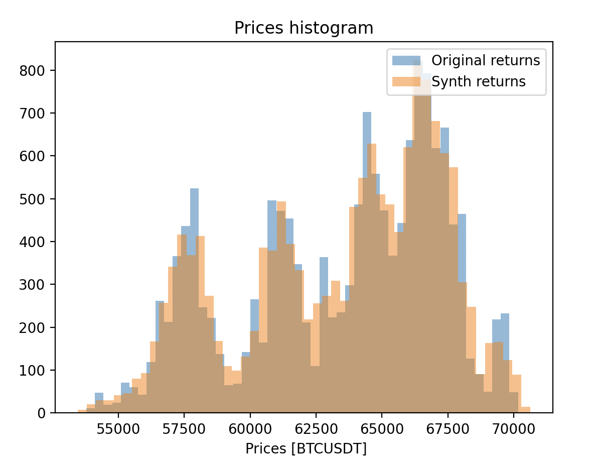

# TradeBot — Learning Market Dynamics from Synthetic Correlations
Simulate common trading bots on real crypto data and prove that a neural networks is able to capture the pattern!

This project proves that a neural network can learn meaningful market patterns
that stem from commonly used pre-programmed bots on the real market.
It also permits its implementation in a real-time trading bot,
and includes different tools for getting, analyzing and pre-processing data.
It is meant to make this whole process more easy!


## First install with: 

`pip install marketML`

## Example code:

```python
    cryptodata = CryptoDataGetter()
    synth = SyntheticTrader(cryptodata)
    synth_machine = LSTMachine().init(candle = "5min", layer1 = 40, layer2 = 15, lookb = 10, learn_rate = 0.03 , dropout = 0.1, reg = 1e-4)

    """ ## Call historical data, simulate and apply an artificial trader ## """

    _, _, synth_target, synth_features = cryptodata.get_historical_data_trim(
    ["1 August 2024 00:00:00", 15000], "BTCUSDT", Client.KLINE_INTERVAL_5MINUTE,
    transform_func=synth.linear_RSI, transform_strength = 0.02, plot = False)

    """ ############# Prepare Inputs, train the Neural Network ########### """
    x_train, y_train, x_val, y_val, scaler = cryptodata.split_slice_normalize(lookb = 10, lookf = 5, target_total = synth_target, features_total = synth_features)

    trainmean, train_std, valmean, val_std = synth_machine.fit(x_train, y_train, x_val, y_val, epochs = 50, batch = 16)

    """ ############## Plot training and some examples #################### """
    plot = MachinePlotter(synth_machine)
    plot.plotmachine(trainmean, train_std, valmean, val_std)
    plot.plot_tape_eval(x_val, y_val)
```

From the original candlestick crypto data above,

We modify it by introducing a linear RSI trader that causes a price shift:


The model learns much more from this synthetic data than from the original pattern. This is due to the explicitly introduced correlation between the target price and a certain features: RSI.


After averaging of the price returns by lookf, we can compute the correlations C_i(tau) between returns and the i-th feature (RSI):




We can see theoretically the "predictiveness" of future prices based on their linear (there are higher order correlatios) correlation with past features/technical indicators:

The main training result is not surprising, but this framework provides the opportunity to test different models and traders,
with the goal to find the model that can capture the most trade bots. 

###################################################################

For clarity, the input of the model, X, is always composed of the last N timesteps x M features (we use 13). The example above only used RSI.


In the histogram, we can wee the broadening of the price fluctuations due to the synthetic trader.



CHATGPT:
❗ But here are the necessary caveats

A visible correlation pattern does not guarantee:

✘ stability over time
✘ stationarity
✘ profit after execution costs
✘ non-spurious correlation

Most market effects die immediately once lag is applied or when non-stationarity is handled.

🔍 What makes your observation stronger

Your result becomes meaningful if:

✔ The shape persists across:

different time windows

bull/bear regimes

multiple assets

And 

So the shape you see might be:

📌 artifact of convolution
📌 not true predictability

To rule this out:

Compare your C_RSI(τ) against:

🔥 shuffled-price RSI
🔥 white noise price series
🔥 randomly permuted returns


## 🧠 Project Overview

1. Load historical BTCUSDT data  
2. Compute technical indicators and prepare model inputs  
3. Diagnose data distributions and correlations  
4. Generate synthetic market data with controlled structure  
5. Train neural network on real vs synthetic data  
6. Simulate a trading bot using trained model  


